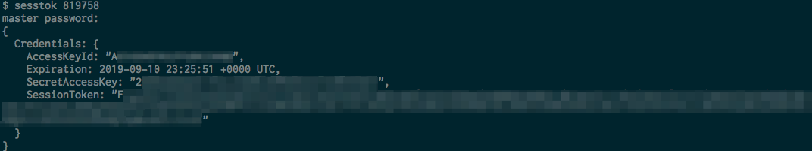
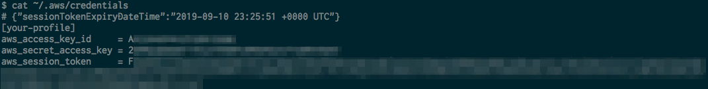

# sesstok

A CLI tool to get AWS onetime session token on MFA enabled environment and update it automatically.

See also: [https://aws.amazon.com/premiumsupport/knowledge-center/authenticate-mfa-cli/](https://aws.amazon.com/premiumsupport/knowledge-center/authenticate-mfa-cli/)

## Features

- Get STS onetime session token
- Update AWS credentials file automatically once it has retrieved a session token
  - It updates following items
    - `aws_access_key_id`
    - `aws_secret_access_key`
    - `aws_session_token`
- RC file of this tool is encrypted by passphrase for security

## Usage

```
Usage:
  sesstok [OPTIONS] [TokenCode]

Application Options:
  -r, --rc=          configuration file path of sesstok (default: $HOME/.sesstok.rc)
  -c, --credentials= file path of AWS credentials (default: $HOME/.aws/credentials)
  -p, --password     use master password; if you've configured a master password, this option has to be specified'
  -P=                (NOT RECOMMENDED) pass the master password
  -d, --duration=    duration of STS session token (unit: second) (default: 86400)
  -D, --dryrun       dryrun mode (i.e. don't update credentials file)
  -s, --silent       silent mode
  -v, --version      show the version
      --dumprc       dump rc file contents
      --init         initialize a configuration (this option can be used with -r (--rc) options)

Help Options:
  -h, --help         Show this help message
```



After execute the command, it updates AWS credentials file automatically.



### Initializing

When you run this tool for the first time, it requires the initializing procedure.


- `master password`: password to encrypt a rc file
- `Access Key ID`: AWS access key ID for assume role
- `Secret Access Key`: AWS secret access key for assume role
- `MFA serial`: MFA serial number (i.e. ARN)
- `Profile Name`: AWS profile name (this tool updates AWS credentials automatically for this specified profile)

## FAQ

### How to switch multiple AWS profiles

Please switch the rc files.

### How to build

```
make build VERSION=x.y.z
```

Pre-built binaries are [here](https://github.com/moznion/sesstok/releases).

LICENSE
--

```
The MIT License (MIT)
Copyright © 2019 moznion, http://moznion.net/ <moznion@gmail.com>

Permission is hereby granted, free of charge, to any person obtaining a copy
of this software and associated documentation files (the “Software”), to deal
in the Software without restriction, including without limitation the rights
to use, copy, modify, merge, publish, distribute, sublicense, and/or sell
copies of the Software, and to permit persons to whom the Software is
furnished to do so, subject to the following conditions:

The above copyright notice and this permission notice shall be included in
all copies or substantial portions of the Software.

THE SOFTWARE IS PROVIDED “AS IS”, WITHOUT WARRANTY OF ANY KIND, EXPRESS OR
IMPLIED, INCLUDING BUT NOT LIMITED TO THE WARRANTIES OF MERCHANTABILITY,
FITNESS FOR A PARTICULAR PURPOSE AND NONINFRINGEMENT. IN NO EVENT SHALL THE
AUTHORS OR COPYRIGHT HOLDERS BE LIABLE FOR ANY CLAIM, DAMAGES OR OTHER
LIABILITY, WHETHER IN AN ACTION OF CONTRACT, TORT OR OTHERWISE, ARISING FROM,
OUT OF OR IN CONNECTION WITH THE SOFTWARE OR THE USE OR OTHER DEALINGS IN
THE SOFTWARE.
```

